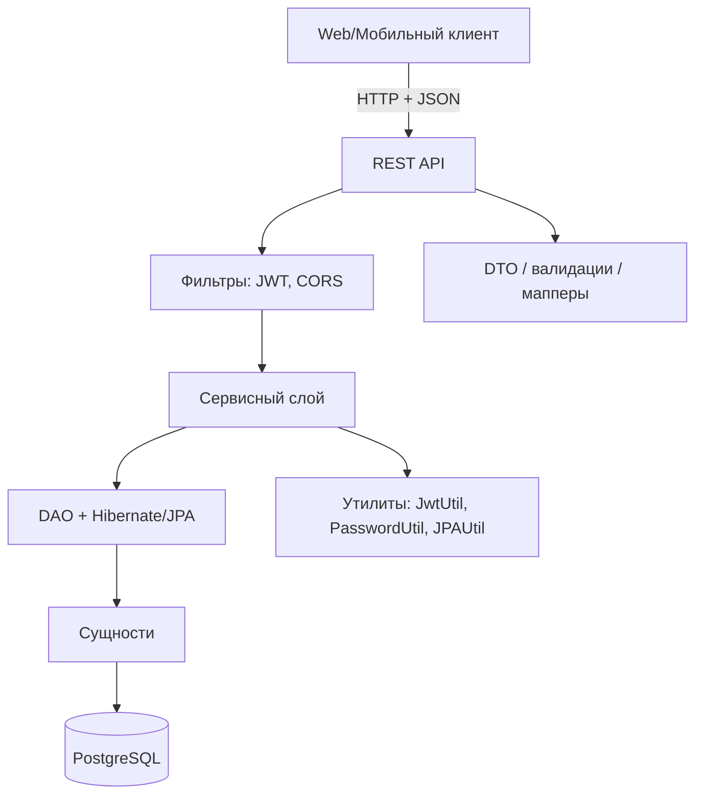

# Бэкенд

Бэкенд реализует бизнес-логику системы по управлению рестораном. Он обеспечивает CRUD операции с сотрудниками, меню и ингредиентами, реализует жизненный цикл заказа, позволяет оставлять обратную связь. Сервис написан на Java 17 с использованием Jakarta EE 10 и разворачивается как `WAR` внутри любого совместимого сервлет-контейнера.

## Архитектура и ключевые решения
- **Слоистая структура**: REST-ресурсы (JAX-RS) → сервисы → DAO → сущности JPA → PostgreSQL. Валидации, мапперы и DTO изолированы в отдельных пакетах, чтобы минимизировать связанность.
- **Persistence**: Hibernate ORM работает через `persistence.xml` (`MyPU`) и `JPAUtil`, автоматически создавая EntityManager per request.
- **Безопасность**: `JwtAuthFilter` проверяет Bearer-токены, выпущенные `AuthService` через `JwtUtil`. Пароли хешируются `BCrypt`, а роль сотрудника упакована в claim `position` и доступна через `SecurityContext`.
- **Интеграция с фронтом**: фронт общается через `/api/**`; схема контрактов описана в `back/openapi.yaml`, что позволяет генерировать клиентов или использовать Swagger UI.

### Диаграмма слоёв

## Основные возможности API
- **Аутентификация** (`AuthResource`): регистрация администратором, выдача одноразового кода и обмен на JWT.
- **Управление персоналом** (`EmployeeResource`, `WalletResource`): учет сотрудников, ролей (`Positions`), кошельков и аутентификации по должности.
- **Меню и склад** (`DishResource`, `IngredientResource`, `DishIngredientService`): CRUD по блюдам, ингредиентам и их связям с проверками (`DishValidator`, `IngredientValidator`).
- **Работа зала** (`JournalResource`, `OrderResource`, `BillResource`): статусы столов (`TableStatus`), создание заказов, привязка блюд, фиксация счетов и синхронизация с журналом.
- **Обратная связь и отчёты** (`FeedbackResource`, `ReportResource`): хранение отзывов клиентов, расчёт агрегированных показателей по сотрудникам и сменам.

## Технологический стек
- Java 17, Maven, упаковка `war`
- Jakarta EE 10 (JAX-RS, CDI, Bean Validation, JPA API)
- Hibernate ORM 6, PostgreSQL 14+
- Lombok для сокращения шаблонного кода
- JSON Web Token (`java-jwt`) и `BCrypt` (`jbcrypt`) для безопасности

## Безопасность и правила доступа
- JWT выдаётся только после успешного входа; Claim `position` должен совпадать с требуемой ролью (`isUserInRole`).
- `JwtAuthFilter` пропускает публичные пути (`auth/login`, `feedback`), все остальные запросы требуют `Authorization: Bearer <token>`.
- Пароли никогда не хранятся в открытом виде: `PasswordUtil` применяет `BCrypt` с солью.

## Документация API
Спецификация в `back/openapi.yaml` охватывает все ресурсы, типы данных и схемы безопасности. Файл можно подключить к Swagger UI или использовать генераторы (`openapi-generator-cli`) для создания клиентов.

